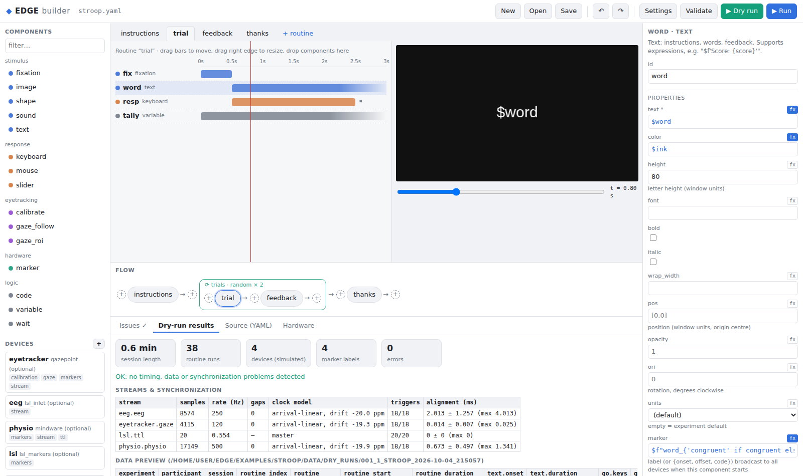
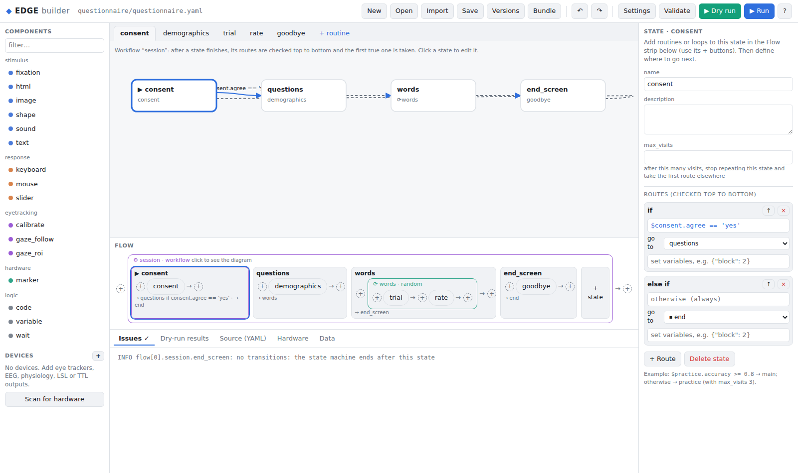
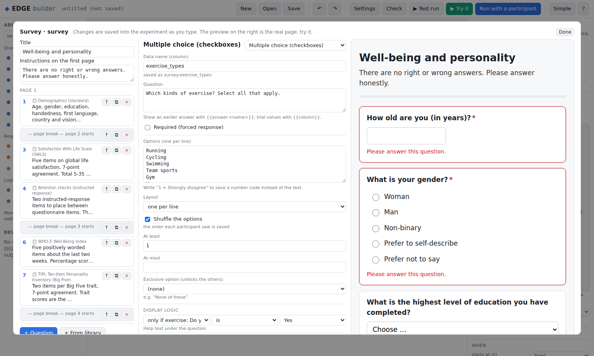

# EDGE

**EDGE is an experiment builder and runtime for behavioral, eye-tracking, physiology and EEG research.**
It covers what E-Prime and PsychoPy do and adds a hardware and synchronization layer that treats
every device as part of the experiment, not something bolted on afterwards.



```
edge                               # open the builder on your experiments folder (or double-click the EDGE icon)
edge wizard                        # answer a few questions, get a finished, tested experiment
edge mcp                           # let Claude / VS Code build experiments from plain-language requests
edge run study.yaml --dry-run      # simulated devices + virtual participant, takes seconds
edge run study.yaml -p 012         # the real thing
edge report data/012_1_study_…     # timing, data-integrity and sync report
```

## Why EDGE

| | E-Prime 3 | PsychoPy | **EDGE** |
|---|---|---|---|
| Visual builder | ✓ (Windows only) | ✓ | ✓ in the browser: storyboard of every screen, live preview, undo, Simple and Expert modes, YAML view |
| New users | tutorials | tutorials | **design wizard** (a finished experiment from a few questions), **Try it** (do the experiment inside the builder), plain-language checks with "did you mean", interactive tutorials, one-command installer with a desktop icon |
| Experiment file | binary `.es3` | `.psyexp` XML → generated script | plain YAML or JSON: diffable, reviewable, scriptable |
| Eye trackers | Tobii/EyeLink via add-ons | ioHub | Tobii Pro, Gazepoint (no SDK), any LSL gaze stream, mouse stand-in |
| EEG / physiology | via TTL | via TTL / plugins | g.tec (LSL, Unicorn, g.NEEDaccess), MindWare, any LSL stream, TTL |
| One marker → every device | manual | manual | automatic: one `marker:` reaches TTL, LSL, Gazepoint USER_DATA and Tobii sample tags, stamped with the flip time |
| Clock alignment | — | — | per-device drift-corrected clock models, saved with the data |
| Proof the timing worked | — | — | `edge report`: dropped frames, stream gaps, trigger-to-event alignment per device |
| Test before booking participants | — | partial (pilot mode) | **dry run**: every device simulated on its own drifting clock, a virtual participant answering with realistic RTs, full data output in seconds |
| Gaze-contingent design | scripting | scripting | `gaze_roi` (dwell triggers, AOI stats) and `gaze_follow` components |
| Adaptive procedures | scripting | staircase loops | staircase loops plus constrained randomization (`max_repeat`), Williams Latin squares |
| Data tables | one row per trial (E-DataAid) | one row per loop iteration | one row per trial, ordered columns, **automatic per-condition summary and data dictionary**, Excel/BIDS/Parquet/MATLAB exports, multi-participant merge |
| Saving | single file | single file | atomic saves, automatic version history with undo, conflict detection, crash recovery, `.edgez` bundles |
| Natural language | — | — | **MCP server**: Claude or VS Code builds, edits, dry-runs and analyzes experiments, and edits appear live in the builder |
| Workflow logic | E-Basic scripting | code components | **visual state machines** (repeat until criterion, adaptive paths, screening), "when → do" routine rules, per-component `if`, live loop accuracy/RT |
| HTML | — | Forms component | **HTML pages as experiment steps**: consent, questionnaires, custom JS tasks, with every field saved |
| Questionnaires | — | Forms component | **survey component**: 35 question types covering the professional catalogue (choice, matrix, side by side, form fields, sliders, NPS, rank, constant sum, pick-group-rank, hot spot, heat map, drill down, highlight, signature, file upload, timing, meta info, tree testing, video response, screen capture, location …), display logic, piped text, randomization, **full right-to-left support** for Hebrew with translated messages, and a library of 20 validated, self-scoring instruments (PHQ-9, GAD-7, PSS-10, WHO-5, SWLS, Rosenberg, TIPI, Mini-IPIP, NASA-TLX, SUS, AUDIT-C …) |
| Import | — | — | **PsychoPy, E-Prime, OpenSesame and jsPsych** experiments, with a conversion report |
| Extending | E-Basic | Python | Python plugins for devices and components (entry points) |
| License | commercial | GPL | MIT |

## New to experiment building?

1. Install with one command (it adds an **EDGE** icon to your desktop):
   macOS/Linux `curl -fsSL https://raw.githubusercontent.com/hfelabs-boop/edge/main/install/install_edge.sh | sh`,
   Windows (PowerShell) `irm https://raw.githubusercontent.com/hfelabs-boop/edge/main/install/install_edge.ps1 | iex`.
2. Open EDGE and click **✨ Make a new experiment: answer a few questions**: what participants see,
   how they respond, timing, practice ("until 80% correct"), blocks. You get a finished experiment,
   already checked by a virtual participant: *"64 trials, about 6 minutes"*.
3. Look at the **storyboard**, press **▶ Try it** to do the task yourself, change what you like (the
   value menu next to each property turns any value into a trial-list column), and press **Run with a
   participant**.

The builder starts in **Simple** mode with only the essentials; **Expert** shows everything.
[Getting started](docs/GETTING_STARTED.md) walks through it in 15 minutes.

## Learn EDGE

* **Interactive tutorials** run inside the builder: a coach highlights what to click and moves on when
  you've done each step. Start with `edge tutorial first_experiment`, or pick one on the welcome screen.
* **Help Center:** press **?** in the builder for every guide, search, and the tutorials. Look for
  **📖 docs** links next to components, devices, loops and workflows.
* **In the terminal:** `edge help` lists the guides, and `edge help jitter isi` searches them.
* **Documentation:** [docs/README.md](docs/README.md) has [Getting started](docs/GETTING_STARTED.md),
  [Tutorials](docs/TUTORIALS.md), the [Builder guide](docs/BUILDER_GUIDE.md), a [Cookbook](docs/COOKBOOK.md)
  of tested recipes, an [FAQ](docs/FAQ.md), and component/device/CLI references generated from the code.

## Quick start (with pip)

```bash
pip install -e ".[all]"            # pyglet window, LSL, serial; add [tobii] for the Tobii Pro SDK
edge desktop-shortcut              # optional: the EDGE icon
edge new freeview_eyetracking .     # or: blank, eeg_oddball, staircase
edge run freeview.yaml --dry-run --report
edge builder .                      # open it in the visual builder
```

The included Stroop example records an eye tracker, EEG and physiology, all time-locked to word onset:

```bash
edge run examples/stroop/stroop.yaml --dry-run --report
```

```
Streams
  eeg.eeg: 8575 samples, 250.0 Hz (nominal 250.0), gaps 0, clock arrival-linear drift -20.1 ppm (residual 0.008 ms)
      triggers 19/19 matched; alignment 1.894 ± 1.079 ms (max |err| 3.965 ms)
  eyetracker.gaze: 4116 samples, 120.0 Hz (nominal 120.0), gaps 0, clock arrival-linear drift -19.3 ppm (residual 0.014 ms)
      triggers 19/19 matched; alignment 1.311 ± 0.007 ms (max |err| 1.322 ms)
  physio.physio: 17150 samples, 500.0 Hz (nominal 500.0), gaps 0, clock arrival-linear drift -19.7 ppm (residual 0.011 ms)
      triggers 19/19 matched; alignment 0.951 ± 0.507 ms (max |err| 1.656 ms)
Verdict
  OK: no timing, data or synchronization problems detected
```

In a dry run every device is simulated on its own drifting clock (here about 20 ppm), and EDGE has
to recover that drift from the data alone.

Trigger alignment can't be finer than one sample period: at 250 Hz that is 4 ms, which is the worst case the report shows.

## What an experiment looks like

```yaml
name: stroop
devices:
  - {id: eyetracker, type: gazepoint}                 # or tobii, sim_eyetracker, mouse_gaze …
  - {id: eeg, type: gtec, options: {mode: lsl}}
  - {id: physio, type: mindware, options: {trigger: serial, port: COM3}}
  - {id: lsl, type: lsl_markers}
routines:
  trial:
    components:
      - {id: fix, type: fixation, duration: 0.5}
      - {id: stimulus, type: text, text: $word, color: $ink, start: 0.5,
         marker: "$f'word_{congruent}'"}                 # sent to every device, on the flip
      - {id: resp, type: keyboard, keys: [r, g, b], start: 0.5, duration: 2,
         correct: $correct_key, end_routine: true}
flow:
  - instructions
  - loop: trials
    conditions: stroop.csv
    order: random
    repeats: 2
    max_repeat: {ink: 2}                                 # never more than 2 same-ink trials in a row
    children: [trial, feedback]
```

See [docs/EXPERIMENT_FORMAT.md](docs/EXPERIMENT_FORMAT.md) for the full reference.

### Workflows, rules and HTML pages

```yaml
flow:
  - statemachine: session
    start: consent
    states:
      consent:
        run: [consent_page]                          # an html component with a consent form
        next: [{if: "$consent.agree == 'yes'", goto: practice}, {goto: end}]
      practice:
        run: [practice_loop]
        max_visits: 3
        next: [{if: "$practice_loop.accuracy >= 0.8", goto: main}, {goto: practice}]
      main:
        run: [main_loop]
routines:
  trial:
    rules:
      - {when: "$t > 3 and resp.keys is None", do: [{start: hint}]}
      - {when: "$resp.keys == 'q'", do: [{goto: end}]}
```



In the builder, selecting a workflow shows its live diagram. States, routes and rules are edited
with forms, and every expression field suggests the variables available there.

### Questionnaires

```yaml
- id: after_task
  type: survey
  questions:
    - {instrument: nasa_tlx}                       # validated, scores itself: after_task.tlx_raw
    - {id: strategy, type: single, text: "Did you use a strategy?", options: [Yes, No], required: true}
    - {id: which, type: essay, text: "Which one?", show_if: {strategy: "Yes"}}
    - {instrument: phq9}                           # phq9_total, phq9_total_band, phq9_item9_flag
```

The builder's survey editor shows the real page live next to the questions; **+ From library** adds a
validated questionnaire with its citation and scoring. Write the questions in Hebrew and the
page lays itself out right to left. See [docs/SURVEYS.md](docs/SURVEYS.md).



### Bring your existing experiments

```bash
edge import stroop.psyexp       # also .ebs3 (E-Prime), .osexp (OpenSesame), jsPsych .html
```

See [docs/IMPORT.md](docs/IMPORT.md) for what converts and how.

## Updating

```bash
edge update            # download and install the newest version
edge update --check    # only look whether there is something new
edge update --stash    # keep your own uncommitted changes (put back afterwards)
```

From a copy of the repository you can also double-click `update.bat` (Windows) or run `sh update.sh`
(macOS / Linux). Your experiments and data are never touched. If the update would overwrite changes
you made to EDGE's own files, it stops and tells you instead.

## Hardware

| Device | Driver | How |
|---|---|---|
| Tobii Pro (Spectrum, Fusion, Spark, Nano …) | `tobii` | Tobii Pro SDK, round-trip clock sync, calibration drawn in the experiment window |
| Gazepoint GP3 / HD | `gazepoint` | Open Gaze API over TCP (no SDK), markers in USER_DATA, native calibration |
| g.tec Unicorn, g.USBamp, g.HIamp, g.Nautilus | `gtec` | LSL (default), UnicornPy, or g.NEEDaccess `pygds` |
| MindWare BioLab | `mindware` | TTL event codes into BioLab + optional live LSL; `edge align` for post-hoc alignment |
| Any LSL stream | `lsl_inlet` | recorded into the session, already on the master clock |
| LabRecorder & friends | `lsl_markers` | every marker becomes an LSL marker at its flip time |
| TTL trigger boxes | `ttl_serial` | Brain Products TriggerBox, Cedrus StimTracker/c-pod, Arduino/Teensy |
| Parallel port | `parallel_port` | inpoutx64 (Windows), pyparallel (Linux) |
| EEG / fNIRS / physiology triggers | `trigger_adapter` | pick the system (BioSemi, Brain Products, EGI, ANT Neuro, NIRx, Artinis, Bitbrain, BIOPAC, ADInstruments, MRI): connection, lines, pulse width and wiring are set for you |
| Response boxes & inputs | `serial_inputs`, `parallel_inputs`, `labjack`, `voice_key` | Cedrus pads and light sensors, fMRI buttons and scanner triggers, Arduino/BBTK boxes, LabJack, microphone voice key; used with the **Button box / external input** component; a light sensor measures the real display latency |
| Closed loop | `udp_messages`, `$devices.<id>.<channel>` | another program (a classifier, a tracker) steers the running experiment with UDP messages; any expression reads the latest sample of any device |
| No hardware yet | `sim_eyetracker`, `sim_eeg`, `sim_physio`, `mouse_gaze`, `ttl_loopback`, `sim_inputs` | realistic simulators on drifting clocks; a virtual participant that presses box buttons and speaks |

`edge scan` finds LSL streams, serial ports, Tobii trackers and Gazepoint Control, and suggests a
config for each. The builder's **Hardware** tab does the same with one-click "add".

See [docs/DEVICES.md](docs/DEVICES.md) for setup, wiring and how the synchronization works.

## Data

Each session writes one plain-text folder that opens anywhere, with analysis-ready tables
generated automatically:

```
trials_wide.csv      one row per trial, columns ordered ids → design → conditions → responses → timing
summary.csv          accuracy, miss rate, RT mean/median/SD per participant and condition level (correct trials, outliers removed)
data_dictionary.csv  every column explained: meaning, type, units, levels, range, missing
events.jsonl         every marker with flip time and per-device delivery time
streams/*.csv        device data with device time, arrival time and aligned master time
session.json         settings, devices, clock models, marker codebook, timing summary, seed, software version
```

```bash
edge export data/ --formats csv,xlsx,bids    # merge all participants; Excel workbook; BIDS tree
```

See [docs/DATA.md](docs/DATA.md) for how the tables are built and for all save, load and export features.

## Talk to it: MCP for Claude and VS Code

```bash
pip install -e ".[mcp]"
claude mcp add edge -- edge mcp --root .          # Claude Code (VS Code: .vscode/mcp.json is included)
```

> "Build a 2-back task with letters, 3 blocks of 30 trials, g.tec EEG over LSL and TTL triggers,
> dry-run it and give me the expected session length."

The 51 tools cover building experiments (including the design wizard and questionnaires) and editing them (with all-or-nothing batch edits), devices,
validation, dry runs, real runs, session analysis, exports, undo and version history, and
opening the visual builder. Edits are validated, backed up and show up live in an open builder.
See [docs/MCP.md](docs/MCP.md).

## Status

This is an early release (0.1). The runtime, builder (checked end to end in a real browser), design wizard, Try it, data pipeline, exports, MCP server, simulators and the LSL and
Gazepoint protocol paths are covered by the test suite (`pytest`; LSL against real liblsl,
Gazepoint against a protocol-level mock server). The Tobii, g.tec, MindWare, serial and parallel
drivers follow the vendors' documented APIs but have **not yet been run against physical devices**.
Validate them on your hardware (photodiode + trigger loopback) before collecting data. The installer
scripts are tested on Linux; the stand-alone app recipe (`install/edge.spec`, built by the release
workflow) is experimental.
[ROADMAP.md](ROADMAP.md) lists what comes next.

## Development

```bash
pip install -e ".[all,dev]"
pytest
```

The docs explain the architecture ([docs/ARCHITECTURE.md](docs/ARCHITECTURE.md)), how to write a
device driver, and how to add components.
