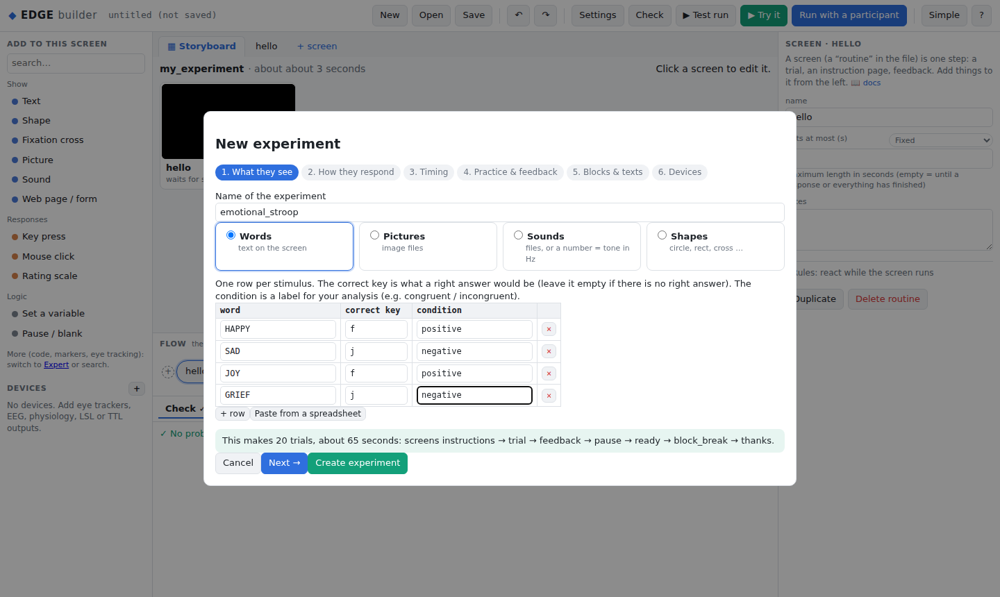

# Getting started

This page takes you from nothing to a tested experiment in about 15 minutes. No programming needed.

## 1. Install

The installers need **Python 3.10 or newer** (they tell you where to get it if it's missing). They make
a private environment in `~/.edge`, so nothing else on your computer changes, and they put an **EDGE**
icon on your desktop.

| You have | Do this |
|---|---|
| **macOS / Linux** | in a terminal: `curl -fsSL https://raw.githubusercontent.com/hfelabs-boop/edge/main/install/install_edge.sh \| sh` |
| **Windows** | in PowerShell: `irm https://raw.githubusercontent.com/hfelabs-boop/edge/main/install/install_edge.ps1 \| iex` |
| A downloaded copy of EDGE | run `install/install_edge.sh`, or right-click `install/install_edge.ps1` → *Run with PowerShell* |

To update later, run `edge update` (or double-click `update.bat` on Windows / run `sh update.sh` on macOS and Linux
if you have the EDGE folder): it downloads the newest version and installs it, and never touches your
experiments or data. More options are in [install/README.md](../install/README.md).

<details><summary>Installing with pip instead (for Python users)</summary>

```bash
git clone https://github.com/hfelabs-boop/EDGE.git
cd EDGE
pip install -e ".[all]"
edge desktop-shortcut        # optional: the EDGE icon
```

`[all]` adds the experiment window (pyglet), Lab Streaming Layer, serial trigger boxes and the
MCP server. Extras you might also want:

| extra | for |
|---|---|
| `pip install -e ".[tobii]"` | Tobii Pro eye trackers |
| `pip install -e ".[html]"` | showing HTML pages in a native full-screen window (otherwise the browser is used) |
| `pip install -e ".[export]"` | Parquet and MATLAB exports |

`edge --version` and `edge devices` check the installation.
</details>

## 2. Open EDGE

Double-click the **EDGE** icon (or type `edge` in a terminal). The builder opens in your browser on your
experiments folder, `Documents/EDGE Experiments`. Everything stays on your computer.

## 3. Make an experiment by answering questions

On the welcome screen, click **✨ Make a new experiment: answer a few questions**. Six short pages ask:

1. **What participants see**: words, pictures, sounds or shapes, and the list of stimuli (one row each,
   with the correct key and a condition label; you can paste them from a spreadsheet).
2. **How they respond**: a key press, a click, a rating scale, or nothing.
3. **Timing**: fixation cross, how long the stimulus stays, the response time limit, the pause between trials.
4. **Practice and feedback**: no practice, practice once, or *practice until good enough* (e.g. 80%
   correct, at most 3 rounds), and whether to show "Correct!" / "Wrong".
5. **Blocks and texts**: number of blocks, repeats, order, break text, instructions, goodbye.
6. **Questionnaires and devices** (optional): consent, demographics and validated questionnaires
   (PHQ-9, Big Five, NASA-TLX …, see [Surveys](SURVEYS.md)); eye tracker, EEG, LSL markers, trigger box
   (simulated until you connect real ones).



The bottom line updates as you go: *"This makes 64 trials, about 6 minutes"*. Press **Create
experiment**: EDGE writes the experiment, opens it, and immediately runs a **test run** with a
virtual participant to prove it works.

Prefer the terminal? `edge wizard` asks the same questions.

## 4. Look at it, try it

* The **storyboard** shows every screen in order as a picture, with trial lists drawn as boxes
  ("⟳ trials: 8 rows × 2, random order"). Click a screen to change it.
* **▶ Try it** runs the experiment right in the builder: press the keys and click like a participant
  would. At the end you see your accuracy and response times. (Try it can also run just one screen
  for five trials.)
* **▶ Test run** lets a virtual participant do the whole experiment in seconds, with every device
  simulated on its own drifting clock, and shows the data it produced.
* **Check** lists anything wrong in plain words, e.g. *"The trial list has no column called 'ink'.
  Did you mean 'colour'?"*. Click a message to jump to the spot.

## 5. Change it

Select something on a screen (a text, a picture, a key press) and edit it on the right. Next to each
property, a small menu says where the value comes from:

* **Fixed**: the same on every trial.
* **⟳ a column**: a different value on each trial, taken from the trial list (e.g. ⟳ `word`).
* **+ New trial-list column…**: makes the column for you (and a trial list, if the screen has none).
* **Formula**: for experts, e.g. `$f'Score: {score}'`.

Rarely needed properties are folded under **More options**. The **Simple / Expert** button (top
right) shows every option, the YAML source and the hardware scanner when you want them.

## 6. Run it with a participant

Press **Run with a participant**. EDGE suggests the next free participant ID, asks for the session,
real or simulated hardware, and full screen or window, then opens the experiment window and records.
Press **Escape** to stop early; everything so far is saved. When it's done, **See the data** opens
the trial table, the summary per condition, and exports for Excel, SPSS/R (CSV) and BIDS.

From a terminal it's the same:

```bash
edge run study.yaml -p 001 -s 1          # participant 001, session 1
edge report data/001_1_study_*           # timing and synchronization check
edge export data/ --formats csv,xlsx     # one table for all participants
```

## 7. Learn more

* **Interactive tutorials**: on the welcome screen or under **?**. Start with *Your first experiment*,
  which builds a Stroop task by hand in ten minutes and explains every part.
* [Tutorials](TUTORIALS.md): trial lists, workflows (practice until criterion), eye tracking,
  questionnaires, rules, data.
* [Cookbook](COOKBOOK.md): ready-made solutions to common design problems.
* [Devices](DEVICES.md): connecting eye trackers, EEG and physiology.
* [MCP](MCP.md): let Claude build experiments from a description.

## The five ideas behind EDGE

1. A **screen** is one step: a trial, an instruction page, feedback. (In the file it's called a
   *routine*.) It contains **things** (text, pictures, sounds, key presses, gaze areas, markers …)
   placed on a timeline.
2. The **flow** puts screens in order. A **trial list** (a *loop*) repeats screens, once per row;
   each column (`word`, `ink`) can be used as a value. **If/else** and **workflows** decide what
   happens next.
3. A value starting with **`$`** is a **formula**, computed while the experiment runs:
   `$word`, `$resp.rt < 0.5`, `$f'Score: {score}'`.
4. **Devices** (eye trackers, EEG, physiology, LSL, TTL) are recorded and synchronized automatically.
   A **marker** reaches all of them at the moment the stimulus appears.
5. Everything is a plain **YAML file**, readable and versionable. The builder, the command line and
   Claude all edit the same file.
